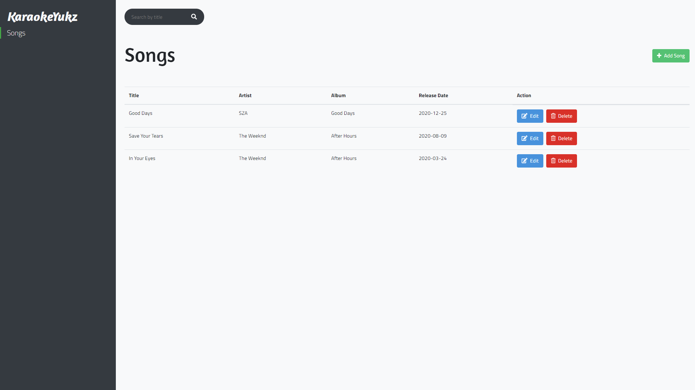
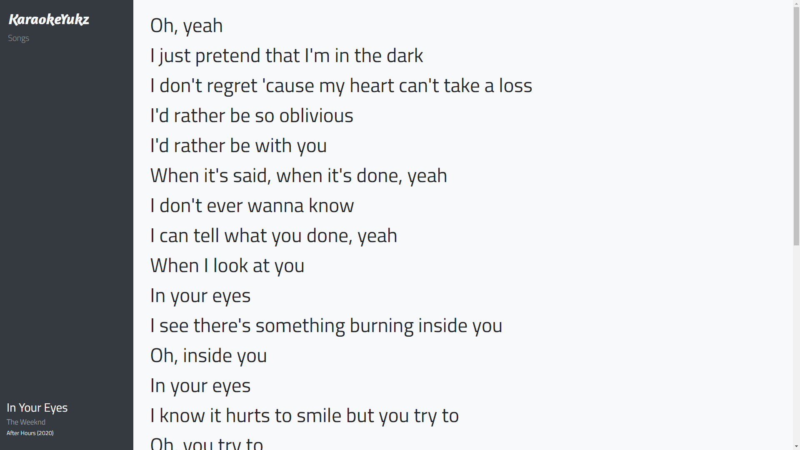

<p align="center"><a href="https://github.com/erickkartiadi/KaraokeYukz" target="_blank"></a></p><br/>

# KaraokeYukz

KaraokeYukz adalah sebuah website yang digunakan untuk memuat lirik lagu yang dibuat menggunakan Laravel

## Features

-   Add, update and delete a song
-   View lyric
-   Search song

## Prerequisites

Before you continue, ensure you have database called `KaraokeYukz`

## Installation

Run `migrations` and `seeders` command.

```bash
php artisan migrate:fresh --seed
```

## Screenshot




## Contact

If you want to contact me you can reach me at erickcartiady@gmail.com
